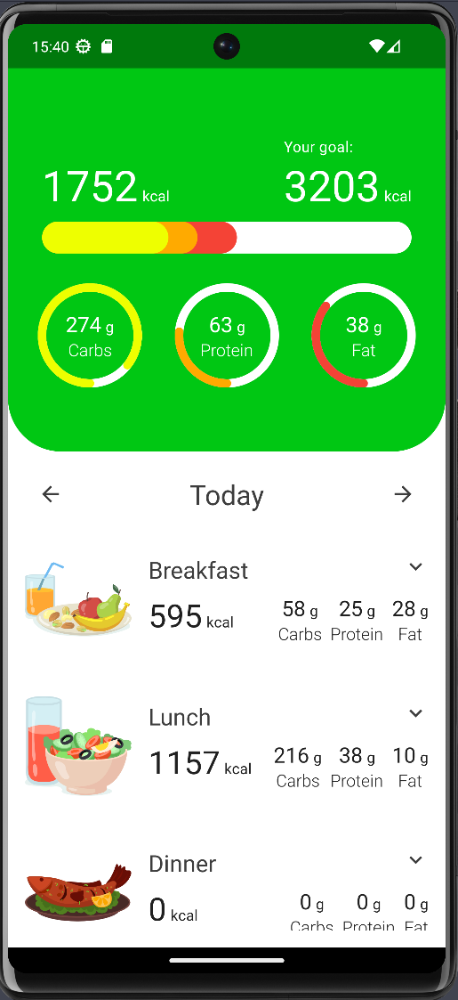
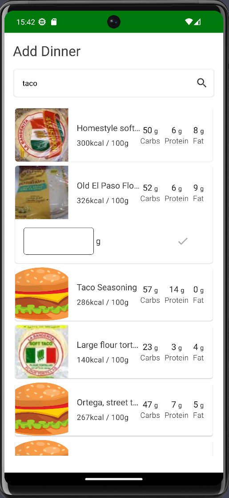

# Calorie Tracker App

Android calorie tracker app built with Jetpack Compose and Open Food API.

## Features

- Jetpack Compose UI. Custom animations, transitions, and layouts.
- Jetpack Compose Navigation.
- Dependency injection with Hilt.
- Modularization (Feature based).
- CLEAN Architecture.
- MVVM design pattern.
- SOLID principles.
- Retrieves foods from the network.
- Tests (Unit, End 2 End).

## Libraries

- Jetpack Compose
- Retrofit
- OkHttp
- Moshi
- Dagger Hilt
- Room
- Navigation
- ViewModel
- Coil (Async Image Loader)
- Junit
- Google Truth
- Turbine
- Hilt Testing

## Result

|  |  |
|--------------------------------------|:---------------------------------------:|

## Download

